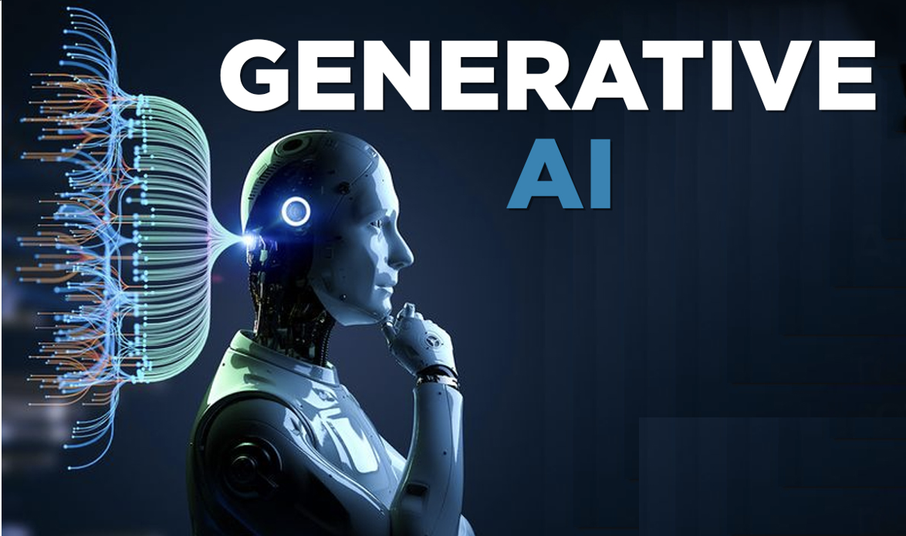
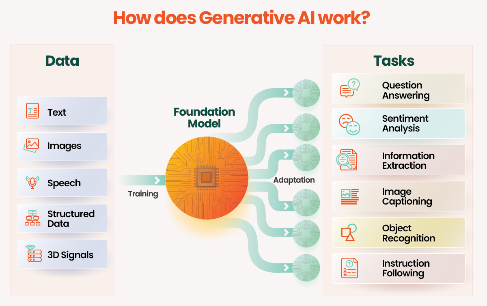

## Introduction to Generative AI

Generative AI refers to artificial intelligence systems capable of creating new content, such as text, images, audio, or video.
This section will introduce the concept, highlighting its ability to produce original outputs based on patterns learned from training data.
It will touch on the rapid advancements in recent years, particularly with models like GPT (Generative Pre-trained Transformer) for text and DALL-E for images. 

## How does Generative AI work?

image source: https://www.tredence.com/generative-ai-101

Generative AI is a complex field that combines various techniques from machine learning and neural networks. To understand how it works, let's break it down into key components and processes:
### Foundation: Neural Networks
At the core of Generative AI are neural networks, which are inspired by the human brain's structure. These networks consist of interconnected nodes (neurons) organized in layers:

Input Layer: Receives the initial data
Hidden Layers: Process the information
Output Layer: Produces the final result

The connections between these neurons have weights that are adjusted during training, allowing the network to learn patterns in the data.

### Training Process

#### Data Collection and Preprocessing

- Gather large datasets relevant to the task (e.g., text, images, audio)
- Clean and preprocess the data to ensure quality and consistency
- Convert data into a format suitable for the neural network (e.g., tokenization for text)

#### Model Architecture Design

Choose an appropriate architecture (e.g., Transformer for language models, CNNs for image generation)
Define the number of layers, neurons, and other hyperparameters

#### Training

- Feed the preprocessed data into the model
- The model makes predictions based on its current state
- Compare predictions to actual data using a loss function
- Use backpropagation to adjust the model's weights, minimizing the loss
- Repeat this process many times with large amounts of data

#### Key Concepts

##### Embeddings

Convert input data (e.g., words, pixels) into dense vector representations
These vectors capture semantic relationships in a high-dimensional space

##### Attention Mechanisms

Allow the model to focus on relevant parts of the input when generating output
Crucial for handling long-range dependencies in data

##### Tokens

Units of input/output, especially in language models (e.g., words or subwords)
The model predicts the probability distribution of the next token given previous tokens

#### Generation Process (Inference)

Once trained, the model generates new content through a process called inference:

- Receive an input prompt or starting point
- Process the input through the neural network
- Generate a probability distribution for the next possible outputs
- Sample from this distribution to select the next element (token, pixel, etc.)
- Add this element to the output and repeat the process
- Continue until a stopping condition is met (e.g., reaching a specified length)

### Techniques for Improving Generation

#### Temperature Sampling

- Controls the randomness of outputs
- Higher temperature leads to more diverse but potentially less coherent results
- Lower temperature produces more focused but potentially repetitive outputs

#### Beam Search

- Explores multiple possible sequences simultaneously
- Helps in finding more optimal outputs, especially for tasks like translation

#### Fine-tuning and Transfer Learning

- Start with a pre-trained model and further train it on specific datasets
- Allows adaptation to particular styles, domains, or tasks

### Evaluation and Iteration

- Use various metrics to evaluate the quality of generated outputs
- Continuously refine the model based on performance and feedback
- Address issues like bias, consistency, and coherence through iterative improvements

## Model Types

Generative AI encompasses various model architectures, each with unique strengths and applications. Here are the main types:

### Large Language Models (LLMs)
- Massive neural networks trained on vast amounts of text data
- Examples: GPT (Generative Pre-trained Transformer) series, BERT, T5
- Capabilities: Text generation, translation, summarization, question-answering
 - Key feature: Able to understand and generate human-like text across diverse topics

### Diffusion Models
- Generate high-quality images by gradually denoising random noise
- Examples: DALL-E 2, Stable Diffusion, Midjourney
- Capabilities: Image generation, image-to-image translation, inpainting
- Key feature: Produce highly detailed and diverse images from text descriptions

### Generative Adversarial Networks (GANs)
- Consist of two neural networks: a generator and a discriminator
- Examples: StyleGAN, CycleGAN, Pix2Pix
- Capabilities: Image generation, style transfer, domain translation
- Key feature: Generate highly realistic images, often indistinguishable from real ones

### Variational Autoencoders (VAEs)
- Encode input data into a compressed representation, then decode it
- Examples: VQ-VAE, β-VAE
- Capabilities: Image generation, feature learning, anomaly detection
- Key feature: Learn compact representations of data, useful for generative tasks and dimensionality reduction

### Transformer-based Models
- Use self-attention mechanisms to process sequential data
- Examples: BERT, GPT, T5 (overlap with LLMs)
- Capabilities: Natural language processing tasks, some image and audio applications
- Key feature: Efficiently handle long-range dependencies in data

## Applications of GenAI

Generative AI is revolutionizing various industries with its diverse applications:

### Natural Language Processing
- Content Creation: Generate articles, stories, poetry, and scripts
- Language Translation: Provide accurate translations between numerous languages
- Chatbots and Virtual Assistants: Create human-like conversational interfaces
- Text Summarization: Condense long documents into concise summaries
- Code Generation: Assist programmers by generating code snippets or entire functions

### Computer Vision
- Image Generation: Create original images from text descriptions
- Image Editing: Manipulate existing images (e.g., style transfer, object removal)
- Video Synthesis: Generate short video clips or animate still images
- Art Creation: Produce original artwork in various styles

### Audio Processing
- Text-to-Speech (TTS): Convert written text into natural-sounding speech
- Voice Cloning: Replicate specific voices for various applications
- Music Generation: Compose original music in different genres and styles
- Sound Effect Creation: Generate custom sound effects for media production

### Cross-modal Applications
- Text-to-Image: Generate images based on textual descriptions
- Image-to-Text: Create captions or descriptions for images
- Text-to-Video: Produce short video clips based on text input
- Audio-to-Video: Generate lip-synced videos from audio input

### Industry-specific Applications
- Healthcare: Drug discovery, medical image analysis, personalized treatment plans
- Finance: Fraud detection, risk assessment, algorithmic trading
- Education: Personalized learning content, automated grading, interactive tutoring
- Entertainment: Video game asset creation, special effects generation
- Marketing: Personalized content creation, ad copy generation, customer segmentation
- Manufacturing: Design optimization, predictive maintenance, quality control

## Challenges of GenAI
While Generative AI offers immense potential, it also presents significant challenges:
### Ethical Considerations
- Bias in AI: Models can perpetuate or amplify societal biases present in training data
- Misinformation: Potential for generating convincing false or misleading content
- Deep Fakes: Creation of highly realistic but fake images, videos, or audio
- Consent and Privacy: Issues around using personal data or likeness without permission

### Environmental Impact
- Energy Consumption: Training large models requires significant computational resources
- Carbon Footprint: High energy use contributes to environmental concerns
- Resource Allocation: Balancing AI advancement with environmental responsibility

### Privacy Concerns
- Data Security: Protecting sensitive information used in training datasets
- Model Inversion Attacks: Potential for extracting training data from models
- Unintended Information Disclosure: Models accidentally revealing sensitive information

### Intellectual Property and Copyright
- Ownership of AI-generated Content: Unclear legal status of AI-created works
- Training Data Copyright: Potential infringement when using copyrighted material for training
- Plagiarism Concerns: Difficulty in distinguishing original vs. AI-generated content

### Economic and Workforce Impact
- Job Displacement: Potential for AI to automate certain creative and analytical tasks
- Skill Obsolescence: Rapid changes requiring continuous workforce upskilling
- Economic Disparities: Unequal access to AI technologies potentially widening economic gaps

### Technical Challenges
- Controlled Generation: Ensuring outputs align with intended parameters and goals
- Consistency and Coherence: Maintaining logical consistency in long-form generations
- Interpretability: Understanding the decision-making process of complex models
- Robustness: Ensuring reliable performance across diverse inputs and conditions

### Regulatory and Governance Issues
- Lack of Standardization: Absence of universal standards for AI development and deployment
- Regulatory Gaps: Existing laws often inadequate for addressing AI-specific issues
- International Cooperation: Need for global coordination on AI governance

### Responsible Development and Deployment
- Ethical Guidelines: Developing and adhering to principles for responsible AI use
- Transparency: Ensuring openness about AI capabilities, limitations, and use cases
- Accountability: Establishing mechanisms for addressing AI-related issues and failures
- Public Trust: Building and maintaining societal confidence in AI technologies

Addressing these challenges is crucial for the sustainable and beneficial development of Generative AI technologies. It requires collaboration between technologists, policymakers, ethicists, and the public to harness the full potential of GenAI while mitigating its risks.

