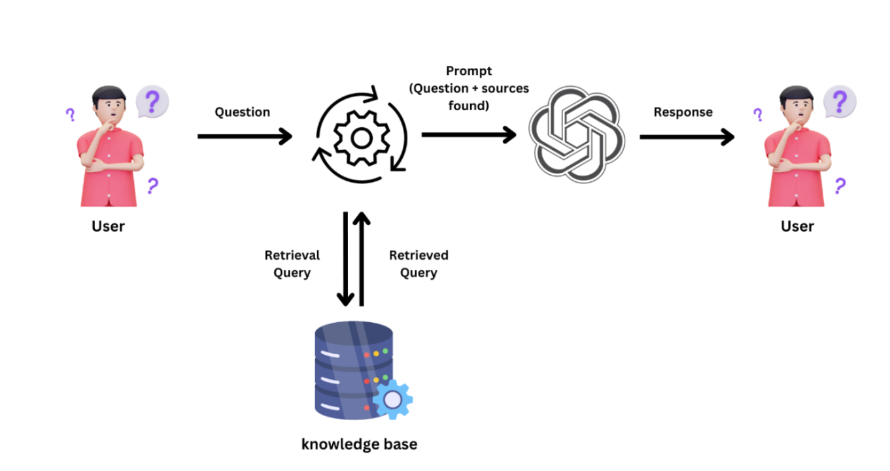

## Getting Started with Naive Retrieval-Augmented Generation: A Practical Guide

**A Base LLM (Large Language Model)** such as GPT-3, GPT-4, or similar, is a type of AI that has been trained on large amounts of text data to predict and generate human-like text based on input prompts. These models are pre-trained on diverse text sources (books, websites, etc.) to capture patterns, context, grammar, facts, and common-sense reasoning from the data. However, base LLMs come with several limitations:

1. Limited and Static Knowledge
    Base LLMs have limited knowledge at the time of their training, making them incapable of retrieving or understanding new information after that point. They cannot update themselves with real-time data or events.

2. Lack of Specific Knowledge
    LLMs are trained on general datasets, so they lack depth in specialized or niche domains. As a result, they may produce inaccurate or shallow answers when queried on specific or technical topic.

3. Hallucination
LLMs can generate false or fabricated information that sounds plausible but is factually incorrect. This limits their reliability, especially when accurate information is critical.

4. No source Attribution
These models cannot provide the original sources of their information, making it difficult to verify the accuracy or credibility of their responses. This can be problematic in applications where source validation is crucial.

5. Privacy and Security Concern
LLMs may unintentionally generate or expose private or sensitive data that was included in their training data, raising concerns around privacy and confidentiality in their usage.

Given these limitations, it's necessary to integrate a knowledge base into the LLM. There are paradigms to do this: Retrieval-Augmented Generation (RAG) and Fine-tuning. In this session, our focus will be on RAG.

**Retrieval Augmented Generation (RAG)** is an AI framework designed to enhance the performance of large language model's (LLM) response. It makes use of external knowledge sources to enhance these models' generation capabilities. Let us understand the RAG Architecture with an example of learning RAG from a database of articles on RAG. The architecture is implemented using LangChain.


**Step1: Document Loader**
Load all the documents from a directory so they can be queried in your system. Depending on the type of files you have (e.g., text files, PDFs, etc.), LangChain offers different document loaders to handle various formats. In this example, we will focus on loading .txt files from a specified directory using the DirectoryLoader class.
```bash
from langchain.document_loaders import DirectoryLoader, TextLoader
loader = DirectoryLoader(path='<PATH_TO_YOUR_DATA_DIRECTORY>', glob = './*.txt', loader_cls= TextLoader)
documents = loader.load()
```
**Step2. Split the texts**
    Once you've loaded all your documents, the next step is to split them into smaller chunks. This is crucial in Retrieval-Augmented Generation (RAG) because
    **Large chunks:** If your chunks are too big, parts of the document that are out of context may get included in the retrieval, leading to inaccurate or irrelevant responses.
    **Small chunks:** If your chunks are too small, you risk losing important context, which can make the information fragmented and less meaningful.
To address this, you can use the text_splitter module from LangChain, which allows you to break down your documents into manageable and context-preserving chunks.
```bash 
from langchain.text_splitter import RecursiveCharacterTextSplitter
# Initialize the text splitter
text_splitter = RecursiveCharacterTextSplitter(
    chunk_size=1000,   # Size of each chunk (e.g., 1000 characters)
    chunk_overlap=200  # Number of overlapping characters between chunks
)
# Split each document into chunks
document_chunks = text_splitter.split_documents(documents)
```
**Step3. Document Embeddings and Vector Stores**
Once your documents have been chunked into manageable pieces, the next step is to convert these text chunks into numerical representations (embeddings) that can be stored and queried efficiently. This is where document embeddings and vector stores come into play.

Embeddings represent the semantic meaning of a piece of text as a vector of numbers. These vectors are then stored in a vector database, which enables fast and efficient similarity search based on user queries.

Here’s how this process works:
1. Create Embeddings Using Hugging Face Models
    You can use models like sentence-transformers/all-mpnet-base-v2 from Hugging Face to generate high-quality embeddings for the text chunks. These embeddings allow the system to capture the meaning of the text for similarity-based retrieval.
    ```bash
    from langchain.embeddings import HuggingFaceEmbeddings
    from sentence_transformers import SentenceTransformer

    # Define the model for generating embeddings
    model_name = 'sentence-transformers/all-mpnet-base-v2'
    model = SentenceTransformer(model_name, device='cpu')  # Use 'cuda' for GPU acceleration

    # Convert the text chunks into embeddings (numerical vectors)
    texts = [chunk.page_content for chunk in document_chunks]  # Extract text content from each chunk
    embeddings = model.encode(texts, normalize_embeddings=True)  # Normalize the embeddings
    ```

2. Store Embeddings in a Vector Database
    Once the text chunks have been converted into embeddings, the next step is to store them in a vector database like Chroma, which enables fast and efficient similarity search based on user queries.

    ```bash
    from langchain.vectorstores import Chroma

    # Create a vector store using the chunked documents and their corresponding embeddings
    vectordb = Chroma.from_documents(document_chunks, embeddings)
    ```
    
**Step4: Retriever**
    In this step, you will implement the retriever component, which is responsible for searching through the vector store to find relevant document chunks based on a user query.
    Here’s a breakdown of how this works:
    
**1. Converting Vector Store to Retriever**
The Chroma vector store you created earlier holds the embeddings of your document chunks. To search through these embeddings efficiently and retrieve relevant chunks, you convert the vector store into a retriever.
```bash
# Convert the vector store into a retriever
retriever = vectordb.as_retriever()
```
**2. Submitting a Query and Retrieving Relevant Documents**
Once the vector store has been converted to a retriever, you can pass a query to it. The retriever will:
Embed the query (i.e., convert it into a numerical representation).
Compare the query embedding with the stored document embeddings using similarity measures like cosine similarity.
Return the most relevant document chunks based on this comparison.
Here’s how you can retrieve the most relevant chunks:
   
```bash
# Retrieve relevant documents by passing a query
result = retriever.get_relevant_documents("What is LangSmith?")
```

This retriever step is crucial because it determines the quality of the context provided to the generation model in a Retrieval-Augmented Generation (RAG) system. The more relevant the retrieved chunks, the more accurate and informative the final generated response will be.

## Conclusion
In this blog, we’ve covered the key steps to building a Retrieval-Augmented Generation (RAG) system. We started by loading and chunking documents, then created embeddings to represent the text meaningfully. These embeddings were stored in a vector database (Chroma) for efficient retrieval. Finally, we used a retriever to fetch relevant document chunks based on user queries. This setup provides a powerful framework for delivering accurate, context-aware information, making it ideal for tasks like question answering and document search.


